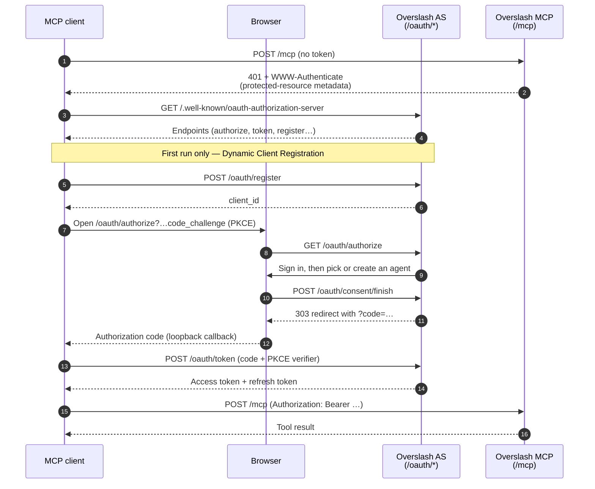

# Connect an MCP client

Overslash ships an MCP Authorization Server at `POST /mcp` with OAuth 2.1. Any MCP client that speaks the Streamable-HTTP transport — Claude Code, Claude.ai, ChatGPT, Cursor, Windsurf, OpenClaw — connects directly: you point it at `https://<your-overslash>/mcp`, the client opens a browser for the OAuth flow, and you confirm or create a scoped **agent identity** that the client will act as from then on.

::: tip Why a separate agent identity?
The client authenticates as an agent owned by your user, not as you. Its actions are auditable separately, approvals route correctly, and you can revoke the agent without touching your own account.
:::

## The handshake, briefly

1. Client discovers the auth server at `/.well-known/oauth-authorization-server`.
2. Client opens a browser to `/oauth/authorize`.
3. You sign in, pick (or create) an agent on the consent screen.
4. Client exchanges the auth code at `/oauth/token`.
5. From then on, every `POST /mcp` call carries the agent's bearer token.

Details: [Reference → Architecture → MCP OAuth transport](../reference/architecture/mcp-oauth-transport.md).

## Pick your client

- [Claude Code](./claude-code.md)
- [Claude.ai](./claude-ai.md)
- [ChatGPT](./chatgpt.md)
- [Cursor](./cursor.md)
- [Windsurf](./windsurf.md)
- [OpenClaw](./openclaw.md)
- [Other MCP clients](./other-mcp-clients.md)
- [Stdio fallback](./stdio-fallback.md) — for clients that don't speak HTTP MCP yet

## Connecting a service vs. connecting a client

This section is about connecting an MCP **client** (so it can act as an agent). Connecting a **service** — giving Overslash access to Gmail, Google Drive, Google Calendar, and the like — is a separate flow you run from the dashboard.

- Linking a Google service? See [How-to → Link Google services](../guide/how-to/link-google-services.md).

## Local-dev URL

For local development, replace `https://<your-overslash>/mcp` with `http://localhost:3000/mcp` in any of the snippets below.

::: warning Cloud-hosted clients can't reach `localhost`
Claude.ai and ChatGPT connect to your MCP server from their own cloud, not from your machine — a `http://localhost:3000/mcp` URL will never resolve for them. Use them against a publicly reachable instance; keep `localhost` for clients that run on your machine (Claude Code, Cursor, Windsurf, OpenClaw, stdio).
:::
