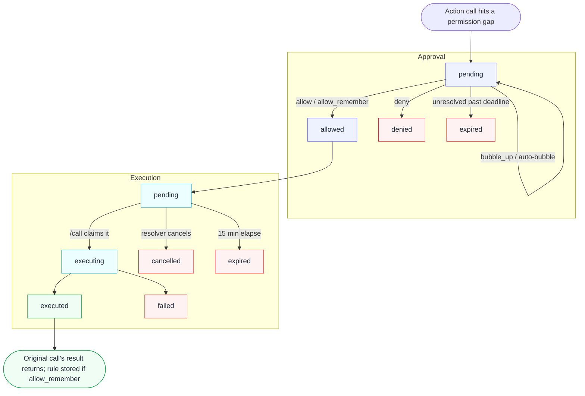

# Approvals

When an agent tries to perform an action that exceeds its standing permissions, Overslash doesn't reject — it **raises an approval**. The action is suspended, a human is notified, and once they resolve the approval (allow once, allow always, deny), the original call resumes from where it paused. Approvals are how Overslash bridges autonomous execution and human accountability.

## Lifecycle

An approval moves through two coupled state machines. The **approval** records the decision; a separate **execution** record runs the action once a decision is made. Decoupling them is deliberate — resolving an approval never runs the action by itself, which is what lets a human approve safely and a different actor (or a background job) carry out the call.

Reading the diagram in words:

1. **Raised.** An action call walks the [permission chain](./permissions.md) and hits a gap. Overslash files an approval (`status = pending`), records the resolved request, and assigns a **current resolver** — the closest ancestor that could grant the permission, or the user.
2. **Notified.** Notifications are held back for one minute. If an ancestor agent resolves it quickly, no human is ever bothered; only approvals still pending after the delay surface a bell badge, email, or webhook. (Each agent may hold at most three pending approvals — a fourth drops the oldest.)
3. **Resolved.** The resolver chooses an outcome (next section). `allow` and `allow_remember` move the approval to `allowed` and create a **pending execution** with a 15-minute lifetime; `deny` ends it; `bubble_up` passes it along.
4. **Action resumes.** The pending execution runs when something calls `/call` — fired automatically right after resolve by default (`auto_call_on_approve`), or manually by the agent or the resolver. The `pending → executing` transition is an atomic, single-winner claim (unique per approval), so an auto-call and a manual call can race without ever double-executing. On success the execution is `executed` and the original call's result returns; if the request was `allow_remember`, the standing rule is written **only now**, on success — never on a cancel, expiry, or failure.

Approval states are `pending`, `allowed`, `denied`, `expired`; execution states are `pending`, `executing`, `executed`, `failed`, `cancelled`, `expired`.

## What can trigger an approval

An approval is raised by a **gap in Layer 2** of the [permission system](./permissions.md) — the agent is within its group's ceiling for the service, but no standing rule covers the specific action. That distinction matters:

- A request that **exceeds the group ceiling** is denied outright. Ceilings are not approvable; no resolver can widen one.
- A **read** on a service whose grant has `auto_approve_reads` set runs immediately, with no approval at all.
- Everything else — a write, or a read on a service without auto-approve — raises an approval when no matching rule exists yet.

Approvals are also an agent-only concept. A request authenticated as a *user* identity is gated by the ceiling alone and never raises an approval; the user is their own approver.

## Resolving from the dashboard

A resolver sees the action summary, the disclosed fields a template chose to surface (see [Audit](./audit.md)), and a specificity picker, then chooses one of:

- **Allow once** — approve this single call.
- **Allow & remember** — approve and store a standing [permission](./permissions.md) rule, with an optional TTL (e.g. `24h`, `30d`), so matching future calls pass without prompting.
- **Deny** — reject the call.
- **Bubble up** — hand the decision to the next eligible resolver up the chain.

Who may resolve is strictly bounded:

| Resolver | Eligible? |
|---|---|
| The originating user | Always (the resolver of last resort) |
| An ancestor agent in the same chain | Yes — but only for permissions within its **own** boundary |
| An org admin | Yes, for any approval in the org |
| The requesting agent itself | By default no — only via an explicitly enabled self-approval path (see below) |
| A sibling or unrelated identity | No |

The trust model is the whole point: by default agents are not trusted to approve their own actions, so resolution requires the credentials of an identity with authority *over* the requester, and there is no self-authenticating approval link. The one exception is opt-in: a human can turn on `self_approve_enabled` for an MCP connection, which exposes the separate [`overslash_approve_self`](../../reference/mcp-tools/overslash_approve.md#self-approval-overslash-approve-self) tool to that user-bound client. The flag is re-checked on every call, so revoking it takes effect immediately, and pure REST callers can never self-approve. If a resolver sits on an approval longer than the org's auto-bubble window (default five minutes), it bubbles to the next ancestor automatically, so an absent agent never wedges the queue.

## Resolving from an agent

Because an ancestor agent is an eligible resolver, an approval can often be cleared without a human at all — a planning agent grants its worker the narrow permission it needs and the task continues. An agent resolves via the [`overslash_approve`](../../reference/mcp-tools/overslash_approve.md) MCP tool, subject to the same boundary rule: it can only grant a descendant a permission it already holds itself (same or narrower keys, same or shorter TTL). When the chain runs out of agents that can help, the approval lands on the user.

See also the `overslash_approve` MCP tool — [Reference → MCP tools → overslash_approve](../../reference/mcp-tools/overslash_approve.md).

## Webhooks

Platforms that surface approvals in their own UX (Slack buttons, a Telegram prompt, a CLI) subscribe to the approval webhooks rather than polling. The execution lifecycle is delivered as `approval.executed`, `approval.execution_failed`, and `approval.execution_cancelled` events; an auto-fired execution carries the full action result inline so a platform can render the outcome from a single delivery. An identity (or org) that drives its own notifications can set `notifications.managed_by_platform = true` to suppress Overslash's built-in bell, email, and delayed webhook and avoid double-prompting.

See also: [Permissions](./permissions.md) for how an approval widens the chain, and [Identities](./identities.md) for the resolver hierarchy.
