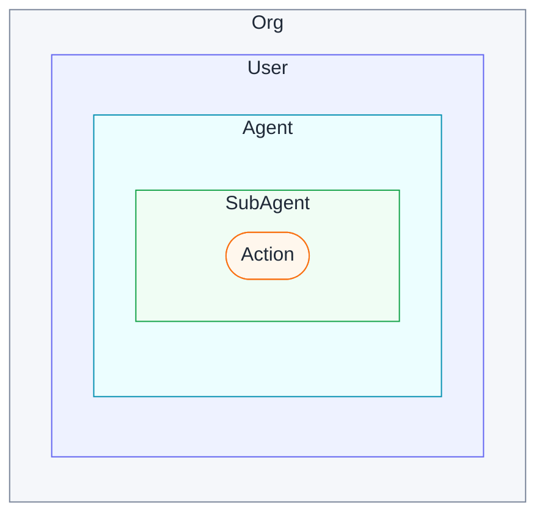

# Concepts

Overslash models a small set of primitives — identities, services, secrets, connections, approvals, and audit — and composes them into a permission chain that runs from a human user down to the action an agent is about to take. These pages explain each primitive on its own and how they fit together.

## The primitives

- [Identities](./identities.md) — users, agents, subagents
- [Services & Actions](./services-and-actions.md) — what an agent can do
- [Secrets](./secrets.md) — the encrypted vault
- [Connections](./connections.md) — OAuth credentials, reusable across agents
- [Approvals](./approvals.md) — human-in-the-loop when permissions run out
- [Permissions](./permissions.md) — the inheritance chain
- [Audit](./audit.md) — what happened, by whom, against what

## Mental model

Identities nest. An organization contains users, a user owns one or more agents, an agent may spawn subagents, and an action is always called from inside one of them. Permission and audit follow that containment — every check walks outward through the ancestors.

A subagent inherits no more than its parent agent could grant; an agent inherits no more than its owning user has authorized. When a call runs out of standing permission it doesn't fail — it raises an **approval**. The originating user can always resolve it; an ancestor agent can too, but only inside its own permission boundary (a parent can never grant a child more than it holds itself). Every step lands in the **audit** log, attributed up the chain to the originating user.

The pages below cover each primitive in isolation; come back here when you need to see how they fit together.
