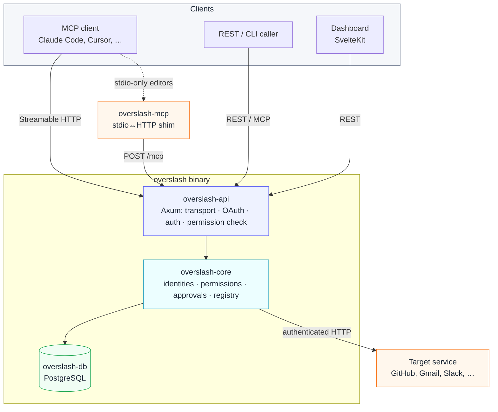
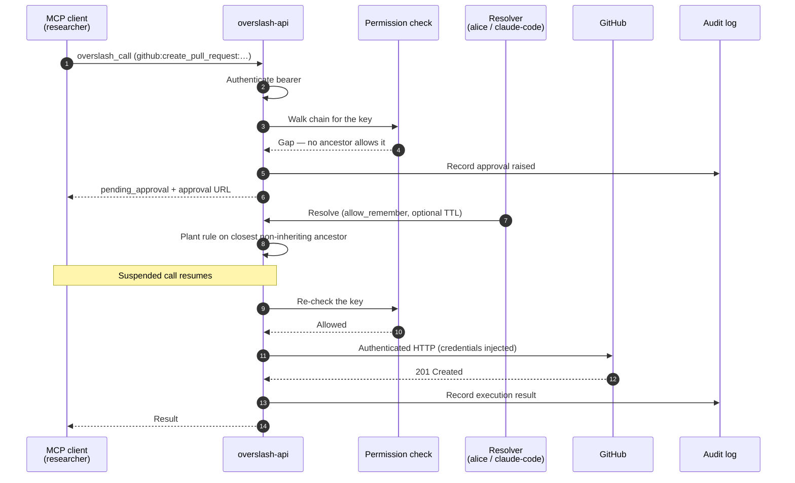

# Architecture overview

Overslash is a Rust + Axum service on top of PostgreSQL, with a SvelteKit dashboard embedded into the same binary. Requests flow through a small set of layers: transport (REST or MCP), authentication (OAuth bearer or static `osk_` key), permission check (the User → Agent → SubAgent chain), execution (service registry lookup → authenticated HTTP), and audit.

::: warning Pre-release
:::

## Components

A single `overslash` binary hosts the API, the domain logic, and (optionally) the dashboard. Editors and callers reach it over HTTP; the binary holds credentials, decides what is allowed, and makes the outbound call to the target service on the caller's behalf.

| Component | Responsibility |
|---|---|
| `overslash-api` (Axum) | HTTP surface — REST API, the OAuth authorization-server endpoints, the `POST /mcp` MCP transport, authentication, and the permission check. |
| `overslash-core` | Domain logic — identities and the permission chain, approval lifecycle, secret handling, service-registry resolution, and the authenticated outbound call. |
| `overslash-db` | Postgres models and migrations. Migrations run automatically on first startup. |
| `overslash-mcp` | A thin stdio↔HTTP shim for editors that only speak stdio MCP; forwards each JSON-RPC frame to `POST /mcp`. See [MCP OAuth transport](./mcp-oauth-transport.md). |
| `overslash-cli` | The binary entry point and its subcommands (`serve`, `web`, `mcp`, …). See the [CLI reference](../cli.md). |
| Dashboard (SvelteKit) | The web UI for orgs and users. Embedded into the binary and served by `overslash web`; it talks to the same REST API. |

## Request lifecycle

Every action call — whether it arrives over REST or MCP — passes through the same five layers:

1. **Transport** — the request lands on the REST router or the `POST /mcp` JSON-RPC handler.
2. **Authentication** — an `Authorization: Bearer` header carries either an OAuth access token (user/agent identity) or a static `osk_` key (agent identity). The request is rejected if neither validates.
3. **Permission check** — the caller's key (`service:action:arg`) is walked against the allow/deny rules on its identity chain. A user-only call skips the fine-grained layer; an agent call enforces it. See [Permissions](../../guide/concepts/permissions.md).
4. **Execution** — on a pass, the service registry is resolved to a concrete endpoint, credentials are injected, and the authenticated outbound HTTP call is made. On a gap, an [approval](../../guide/concepts/approvals.md) is raised and the call suspends until it is resolved.
5. **Audit** — the outcome is written to the audit log against the originating user. See [Audit](../../guide/concepts/audit.md).

## Sample action call

The sequence below traces a call that hits a permission gap, raises an approval, and resumes — the common case when an agent reaches for something it hasn't been granted yet. It follows the walkthrough in [Concepts](../../guide/concepts/index.md#walkthrough): user `alice` owns agent `claude-code`, which spawned subagent `researcher` (`inherit_permissions = true`). The researcher calls `github:create_pull_request:overfolder/backend`.

A call that is already covered by the chain skips steps 4–9: the permission check passes on the first walk and execution proceeds directly.

## Service registry resolution

When a call names a `service:action`, Overslash resolves it through a three-tier registry, most specific first: a user-owned template, then an org-owned template, then the built-in global registry. The resolved template supplies the host, the action-to-endpoint mapping, and how credentials are attached.

Actions reach a target through one of three execution modes:

- **Raw HTTP** — a direct `http:VERB:host/path` call, governed by `http:*` permission keys.
- **Connection-based** — an OAuth [connection](../../guide/concepts/connections.md) supplies the bearer token, refreshed as needed.
- **Service + action** — a registry template maps the action to an endpoint and injects the right [secret](../../guide/concepts/secrets.md) or connection.

See the [Service registry reference](../service-registry.md) for the template format.

## Where to read the code

The crates live under `crates/` in the source repo:

| Crate | Path |
|---|---|
| `overslash-api` | `crates/overslash-api/` |
| `overslash-core` | `crates/overslash-core/` |
| `overslash-db` | `crates/overslash-db/` |
| `overslash-mcp` | `crates/overslash-mcp/` |
| `overslash-cli` | `crates/overslash-cli/` |
